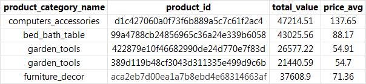

# olist-ecommerce-sql-analysis
The objective of this project is to analyze the commercial performance of an e-commerce platform (Olist) by evaluating sales, customer spending, satisfaction and main sellers using SQL queries on a relational dataset.

**Dataset description**

This project uses the Olist Brazilian E-Commerce Dataset, a public dataset available on Kaggle that contains real transactional data from a Brazilian e-commerce marketplace. To have access to the dataset visit this link: https://www.kaggle.com/datasets/olistbr/brazilian-ecommerce

This dataset represents orders made between 2016 and 2018, including information about customers, sellers, products, payments, reviews, and logistics.

The data is organized in a relational schema, which makes it ideal for SQL-based analysis. The main tables used are the following: olist_orders_dataset, olist_order_items_dataset, olist_customers_dataset, olist_sellers_dataset, olist_products_dataset, product_category_name_translation (Translations of product category names from Portuguese to English) and olist_order_reviews_dataset.

**Relational Model**

**Dataset’s Limitations and Considerations:**
1.	 Some months and years contain missing data, particularly in the order_approved_at column. A NULL value indicates that, at the time the dataset was released, the order had not yet been approved. These observations represent approximately 0.16% of the dataset and were excluded from the analysis to avoid introducing noise in time-based metrics. 
2.	The location does not allow a connection between columns, so a geospatial analysis is not done.
3.	Not all orders have reviews; therefore, analysis involving satisfaction are based only on the subset of reviewed subsets.
4.	The freight value variable represents logistics cost, not company revenue. As such, it should not be interpreted as profit or sales revenue.
5.	Specific names of products and sellers are not provided. Consequently, products and sellers are analyzed using their respective IDs only.
6.	The dataset does not include demographic data about customers or sellers.
7. Price is used as an approximation of the value of the product

**Dataset preparation and cleaning**
To start the analysis, a dedicated SQL database (Brazilian_Ecommerce) is created. All CSV files from the Olist dataset are imported as tables using SQL Server’s Import Flat File feature. Once all tables are imported into the dataset, foreign key constraints are added between tables. To see in more detail go to the file “Setting up the dataset”.

Product category data required additional cleaning. Some products contained NULL values in the product category field; therefore, a new category labeled NE (Not Specified) was added to the category translation table to preserve these observations. Also, invalid and redundant rows in the translation table were removed.

Additionally, missing category translations were identified using a LEFT JOIN comparison between the product and translation tables (see code for details). The missing categories were then inserted into the translation table to complete the relationships between tables and allow product categories to be displayed in English.

# Main Results
**Sales analysis**
According to the analyzed data, total sales in 2016 amounted to USD 49,785.92 (let’s assume the data is in U.S. dollars). This relatively low value is expected, as the dataset only includes transactions starting in September 2016. In 2017, total sales increased significantly to USD 6,145,900.29. Sales continued to grow in 2018, reaching USD 7,394,287.06. Although the 2018 data only covers transactions up to September, total sales for this period still exceed those recorded in 2017.

When comparing cumulative sales from January to September in both years, overall sales increased by 49.75% from 2017 to 2018. This indicates strong year-over-year growth, suggesting that the business was expanding rapidly during this period.

**Categories with the highest revenue**
The top 5 highest products by price value are from the categories: “computer accessories”, “bed bath table”, “garden tools” and lastly, “furniture decor” with prices from USD 54 to USD 138 approximately.

